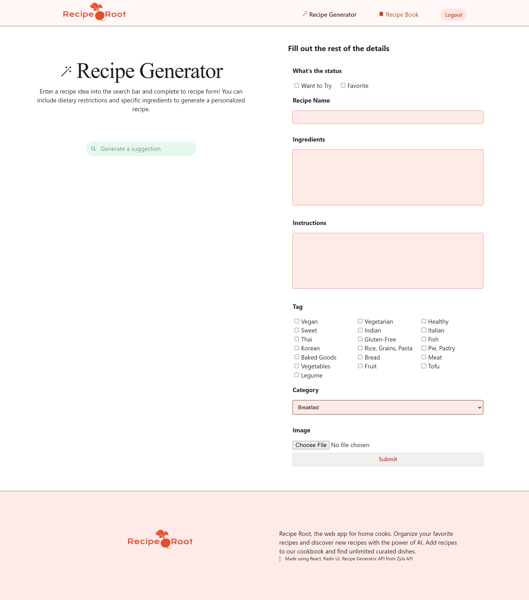

# Recipe Root

> **Completed for ICOM3010 Final Project**
>
> Lauren MacDonald, April 2024
>
> **Languages/Concepts**: JavaScript, React.JS, CSS
>
> **Description**: Recipe Root is a React.js web application that allows
> users to sign up, save recipes to a recipe book, and find new recipes
> using a recipe generator AI API.
>
> Save all of your favorite recipes to the application. Can filter by
> tags, categories, favorites, and want to try distinctions supplied by
> the user.

## How To Use

- On Github click on the "Code" button and copy the url to your clipboard
- In file you want to create repo open terminal and type git clone and paste url and press enter
- Navigate to the recipe-root directory and enter the command (npm install)
- In the terminal navigate to the pocketbase directory and run the command (./pocketbase.exe serve) This will run the pocketbase db locally
- Open a second terminal and navigate to the recipe-root directory
- Run (npm run dev) to launch the React app
- Control click on the url that shows in your terminal and the events page should show up in your browser

## This App Uses:

### PocketBase

An open source SQLite backened that provides a UI dashboard, realtime data, file storage and built in user authentication APIs. https://pocketbase.io/

### Radix UI

An open source headless UI component library. https://www.radix-ui.com/

### Zyla Recipe Generator API

Note that this function requires payment and is not currently connected. https://zylalabs.com/api-marketplace/

## Documentation

.png>)

Welcome to Recipe Root.

View specific recipe details, check off ingredients and instructions as you go. Update the recipe's favorite and want to try statuses.

.png>)

Use the recipe generator AI function to find new recipes and add to the recipe book.

